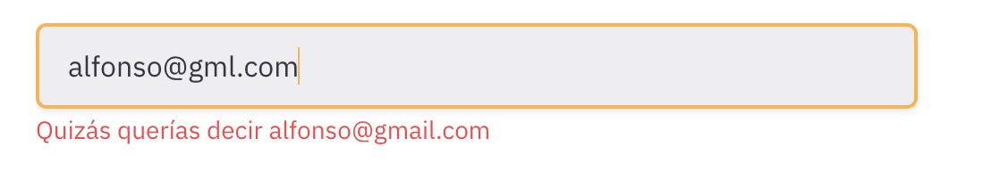

mailcheck.js
=========

[](https://github.com/opositatest/mailcheck/actions/workflows/ci.yml)
[](https://github.com/opositatest/mailcheck/actions/workflows/security.yml)
[](https://www.npmjs.com/package/@opositatest/mailcheck)
[](https://github.com/opositatest/mailcheck/blob/main/src/mailcheck.d.ts)
[](https://developer.mozilla.org/en-US/docs/Web/JavaScript/Guide/Modules)
[](https://github.com/opositatest/mailcheck/blob/main/LICENSE)
[](https://nodejs.org)

The Javascript library and jQuery plugin that suggests a right domain when your users misspell it in an email address.

> Built on the foundations of the original [mailcheck/mailcheck](https://github.com/mailcheck/mailcheck). Thank you for the great work.

What does it do?
----------------

When your user types in "alfonso@gml.com", Mailcheck will suggest "alfonso@gmail.com".

Mailcheck will offer up suggestions for second and top level domains too. For example, when a user types in "alfonso@hotmail.cmo", "hotmail.com" will be suggested. Similarly, if only the second level domain is misspelled, it will be corrected independently of the top level domain.



Installation
------------

```
npm install --save @opositatest/mailcheck
```

Usage
-----

#### ESM (recommended)

```js
import { Mailcheck } from '@opositatest/mailcheck';

// Compatible alternative:
// import Mailcheck from '@opositatest/mailcheck';

Mailcheck.run({
  email: yourTextInput.value,
  domains: ['gmail.com', 'aol.com'],           // optional
  secondLevelDomains: ['hotmail'],             // optional
  topLevelDomains: ['com', 'net', 'org'],      // optional
  suggested(suggestion) {
    // show suggestion to user
    // suggestion = { address: 'test', domain: 'gmail.com', full: 'test@gmail.com' }
  },
  empty() {
    // clear any existing suggestion
  }
});
```

#### CommonJS

```js
const Mailcheck = require('@opositatest/mailcheck');

Mailcheck.run({ /* same options */ });
```

#### Browser via `<script>` tag

Use `dist/mailcheck.browser.min.js`, which also auto-registers the jQuery plugin if `window.jQuery` is present:

```html
<script src="mailcheck.browser.min.js"></script>
<script>
  Mailcheck.run({ email: 'test@gmailc.om', suggested(s) { console.log(s.full); } });
</script>
```

#### With jQuery

Load `mailcheck.browser.min.js` after jQuery and use `$.fn.mailcheck`:

```html
<script src="jquery.min.js"></script>
<script src="mailcheck.browser.min.js"></script>
<script>
$('#email').on('blur', function() {
  $(this).mailcheck({
    suggested(element, suggestion) {
      // show suggestion
    },
    empty(element) {
      // clear suggestion
    }
  });
});
</script>
```

The `suggested` callback receives the jQuery element and the suggestion object. The `empty` callback receives the jQuery element.

Suggestion object
-----------------

```js
{
  address: 'test',         // part before the @ sign
  domain: 'gmail.com',     // suggested domain
  full: 'test@gmail.com'   // full suggested email
}
```

Domains
-------

Mailcheck has inbuilt defaults if `domains`, `secondLevelDomains` or `topLevelDomains` are not provided. We recommend supplying your own based on the distribution of your users.

Replace the defaults entirely:

```js
Mailcheck.run({
  domains: ['customdomain.com', 'anotherdomain.net'],
  secondLevelDomains: ['domain', 'yetanotherdomain'],
  topLevelDomains: ['com.au', 'ru']
});
```

Or extend the global defaults:

```js
Mailcheck.defaultDomains.push('customdomain.com');
Mailcheck.defaultSecondLevelDomains.push('yetanotherdomain');
Mailcheck.defaultTopLevelDomains.push('com.au');
```

Customization
-------------

Mailcheck uses the [sift4](https://siderite.dev/blog/super-fast-and-accurate-string-distance.html) string similarity algorithm. You can replace it with your own:

```js
Mailcheck.run({
  email: 'test@gmailc.om',
  distanceFunction(s1, s2) {
    // return a distance score; lower = more similar
  }
});
```

TypeScript
----------

Types are included:

```ts
import { Mailcheck, MailcheckOptions, MailcheckSuggestion } from '@opositatest/mailcheck';

const opts: MailcheckOptions = {
  email: 'test@gmailc.om',
  suggested(suggestion: MailcheckSuggestion) {
    console.log(suggestion.full);
  }
};

Mailcheck.run(opts);
```

Tests
-----

Requires Node.js ≥ 22.

```
npm test
```

Contributing
------------

Pull requests are welcome. To get them accepted, please:

- Add test cases to `spec/mailcheckSpec.js` for any new behaviour.
- Run `npm run build` before committing — it runs lint, tests, and regenerates `dist/`. The pre-commit hook does this automatically after `npm install`.

Bugs and feature requests are managed in [Issues](https://github.com/opositatest/mailcheck/issues).

Releasing
---------

Releases are published to npm automatically by GitHub Actions when a GitHub Release is published.

#### Publish an existing version

Use this flow when the version is already set in `package.json` and you want to publish that exact version for the first time:

1. Make sure `main` contains the version you want to publish.
2. Go to GitHub → `Releases` → `Draft a new release`.
3. Create a new tag such as `v2.0.0` from `main`.
4. Publish the release.

Publishing the GitHub Release triggers `.github/workflows/publish.yml`, which installs dependencies, runs `npm run build`, and publishes the package to npm.

#### Create the next release

For subsequent releases, use the `Create Release` GitHub Actions workflow:

1. Go to GitHub → `Actions` → `Create Release`.
2. Click `Run workflow` on `main`.
3. Choose `patch`, `minor`, or `major`.
4. Run the workflow.

Do not create the next release tag manually in GitHub for this flow. The workflow runs `release-it`, updates the version, creates the tag, pushes it, and publishes the GitHub Release.

This will:
1. Verify you are on `main`, the working tree is clean, and in sync with origin
2. Bump the version in all files and regenerate `dist/`
3. Commit, tag and push to `origin/main`
4. Create the GitHub Release automatically via API

Once the GitHub Release is published, the `publish.yml` workflow triggers and publishes to npm.

#### Local fallback

If you need to run the same flow locally, these commands still work:

```bash
npm run release          # interactive — prompts for patch/minor/major
npm run release -- patch # 2.0.0 → 2.0.1  (bug fixes)
npm run release -- minor # 2.0.0 → 2.1.0  (new features)
npm run release -- major # 2.0.0 → 3.0.0  (breaking changes)
```


License
-------

Released under the MIT License.
